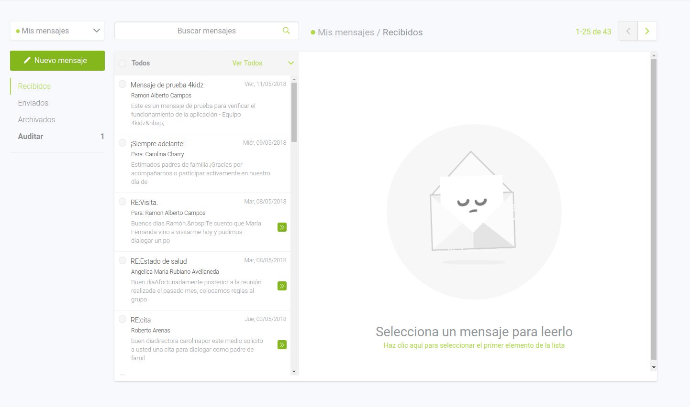

# Hey!

## Welcome to our junior frontend test.

This is a quite straightforward test where we will be able to evaluate your knowledge in:

- HTML5
- CSS3
- JS (React ^16.X or Angular ^5.2)
- Git
- Code Documentation
- API mockup
- Docker (optional but great chance booster)

Given the next image as model you'll have to:



1. Design a dummy API to work with <br/>
    
    A whyNot approach...

    ```json
        {
            inbox: [{
                    id:1,
                    subject: 'Im opting',
                    messageText: 'Some text',
                    createdAt: '2018-05-16',
                    userId: 1
            }],
            outbox: [...],
            archived: [...],
            users: [{
                id: 1,
                fullname: 'Jhon Doe'
            }]
        }
    ```
2. Mark up the image above using css3 and html5 (be careful with the browser support)
3. Document the code the best you can!
4. If possible create a Dockerfile with the node:carbon image
5. Bundle your code and push it!

# Extra points IF:

1. Responsive implementation is made

# Have fun, later!